<!-- HEADER SECTION -->
<h5 align="center" style="padding:0;margin:0;">Anke Du Raan | Hannah Naidoo</h5>
<h5 align="center" style="padding:0;margin:0;">221202 | 21100366</h5>
<h6 align="center">Interactive Development 300</h6>
<p align="center">

  <h3 align="center">Pamper Pets</h3>

  <p align="center">
    Pet Clothing and Accessory Inventory Management System <br>
      <a href=" https://github.com/AnkeatOpenWindow/PamperPets-front-end"><strong>Explore the docs »</strong></a>
   <br />
   <br />
   <a href="https://drive.google.com/file/d/1hrXlPQm_waY5H67_-hV0N54cOaK6-GcC/view?usp=sharing">View Demo</a>
    ·
    <a href="https://github.com/AnkeatOpenWindow/PamperPets-front-end/issues">Report Bug</a>
    ·
    <a href="https://github.com/AnkeatOpenWindow/PamperPets-front-end/issues">Request Feature</a>
</p>
<!-- TABLE OF CONTENTS -->
## Table of Contents

* [About the Project](#about-the-project)
  * [Project Description](#project-description)
  * [Built With](#built-with)
* [Getting Started](#getting-started)
  * [Prerequisites](#prerequisites)
  * [How to install](#how-to-install)
* [Features and Functionality](#features-and-functionality)
* [Concept Process](#concept-process)
   * [Ideation](#ideation)
   * [Wireframes](#wireframes)
   * [User-flow](#user-flow)
* [Development Process](#development-process)
   * [Implementation Process](#implementation-process)
        * [Highlights](#highlights)
        * [Challenges](#challenges)
   * [Future Implementation](#peer-reviews)
* [Final Outcome](#final-outcome)
    * [Mockups](#mockups)
    * [Video Demonstration](#video-demonstration)
* [Conclusion](#conclusion)
* [Contributing](#contributing)
* [License](#license)
* [Contact](#contact)
* [Acknowledgements](#acknowledgements)

<!--PROJECT DESCRIPTION-->
## About the Project
<!-- header image of project -->
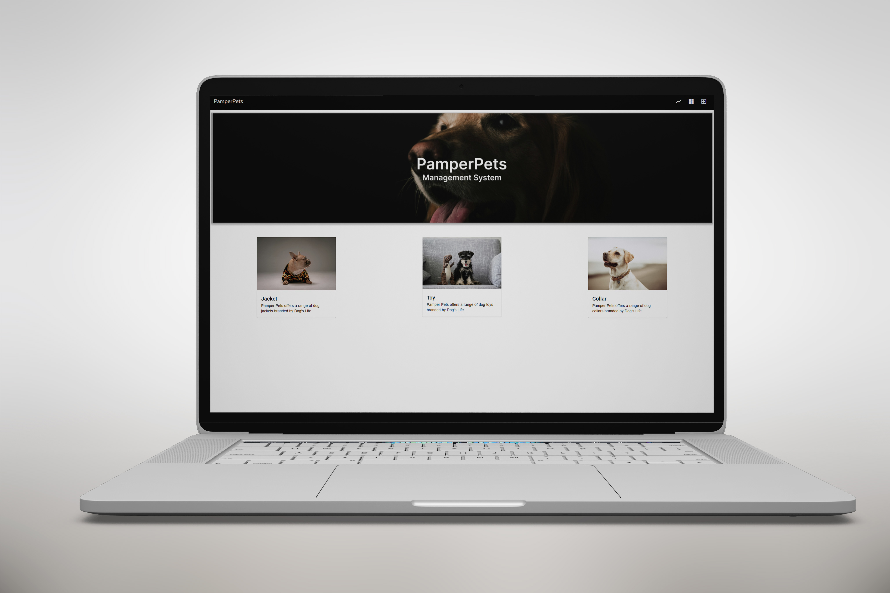

### Project Description

Created an application using TypeScript to track inventory and craft new items for a pet clothing and accessory company. The web app allows multiple users to sign in and to take stock of resources that can be used to craft tools/recipes.

### Built With

* [TypeScript](https://www.typescriptlang.org/)
* [Angular](https://angular.dev/)
* [pgAdmin](https://www.pgadmin.org/)

<!-- GETTING STARTED -->
<!-- Make sure to add appropriate information about what prerequisite technologies the user would need and also the steps to install your project on their own machines -->
## Getting Started

The following instructions will get you a copy of the project up and running on your local machine for development and testing purposes.

### Prerequisites

Ensure that you have the latest version of [Angular](https://angular.dev/) installed on your machine. 

### How to install

### Installation
Here are a couple of ways to clone this repo:

1. Software </br>
`GitHub Desktop` -> `File` -> `Clone repository` -> `URL`</br>
Enter `https://github.com/AnkeatOpenWindow/PamperPets-front-end.git` into the URL field and press the `Clone` button.

2. Clone Repository </br>
Run the following in the command-line to clone the project:
   ```sh
   git clone https://github.com/AnkeatOpenWindow/PamperPets-front-end.git
   ```
    Open `GitHub Desktop` and select `File | Open...` from the menu. Select cloned directory and press `Open in Visual Studio Code` button

3. Run front-end server </br>
Run the following in the front-end command-line:
   ```sh
   npm start
   ```

4. Run backend server </br>
Get backend at [https://github.com/AnkeatOpenWindow/PamperPets-back-end.git](https://github.com/AnkeatOpenWindow/PamperPets-back-end.git)
   ```sh
   npm run dev
   ```


<!-- FEATURES AND FUNCTIONALITY-->
<!-- You can add the links to all of your imagery at the bottom of the file as references -->
## Features and Functionality

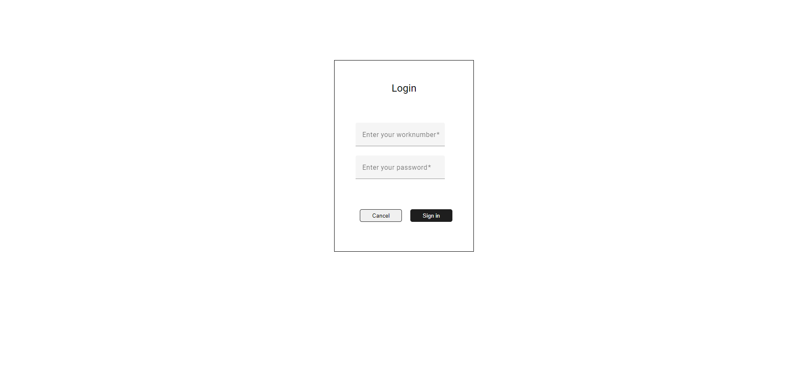
### Authentication

The authentication page allows employees to enter the system with a work number and password validation.

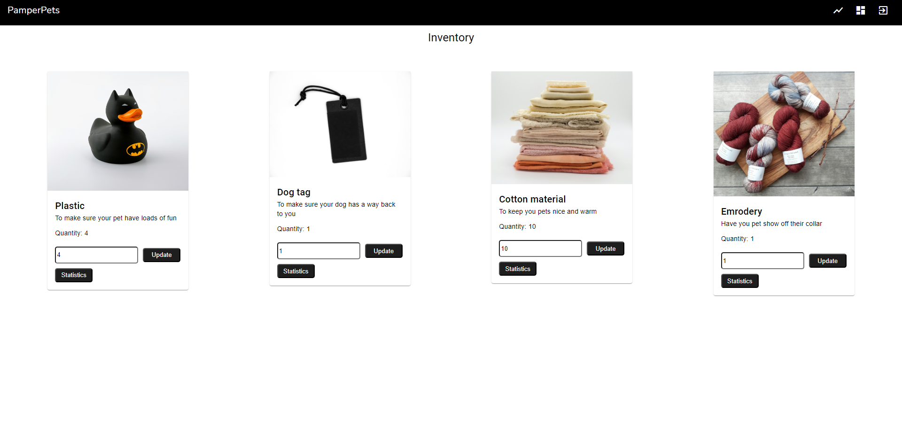
### Inventory

A section to display all of the available inventory/material. Users are able to update the total of each item in the inventory.

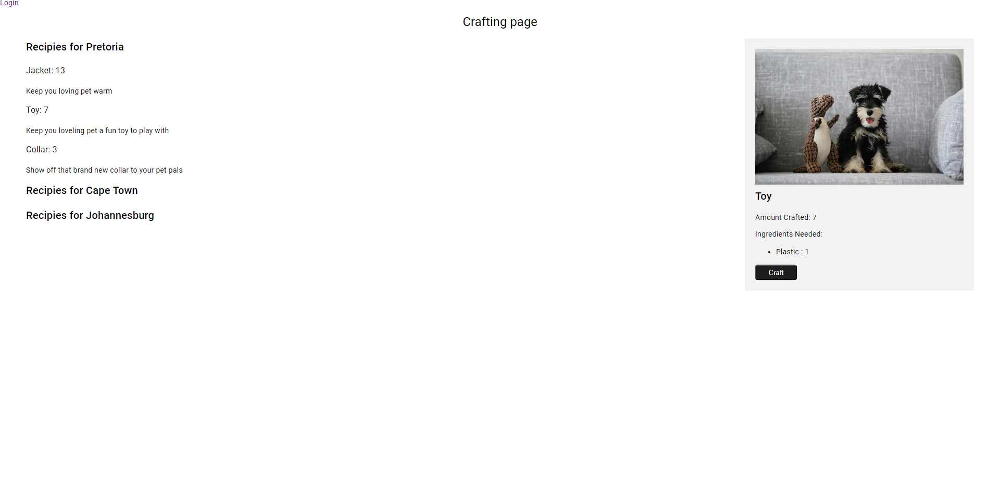
### Craft

A section that allows users to craft recipes/items with the available inventory. Only recipes that have enough of the required ingredients can be crafted.

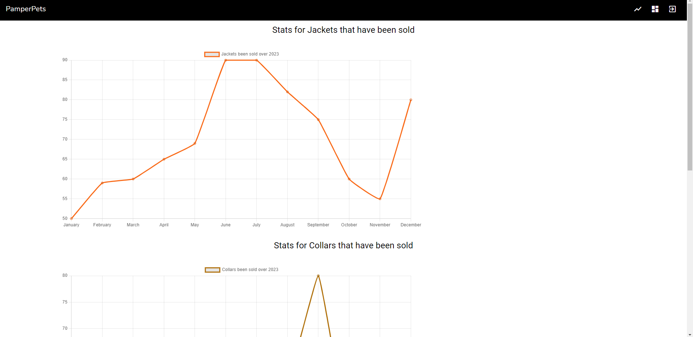
### Statistics

A section that allows employees to view statistics of recipes/items with the available inventory. Only employees can view the statistics.

<!-- CONCEPT PROCESS -->
<!-- Briefly explain your concept ideation process -->
## Concept Process

The `Conceptual Process` is the set of actions, activities and research that was done when starting this project.

### Ideation

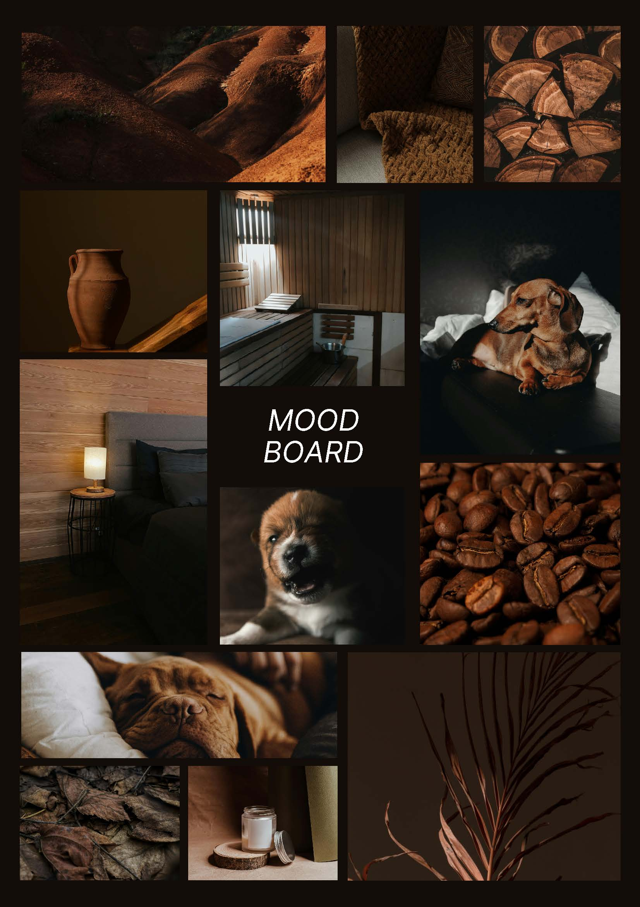

### Wireframes

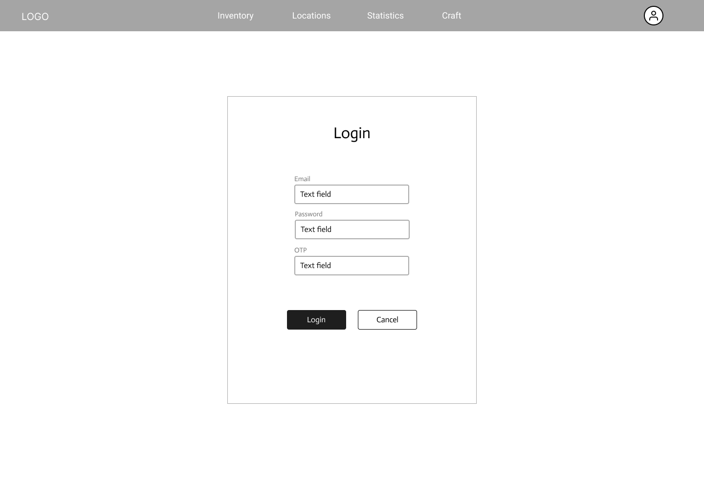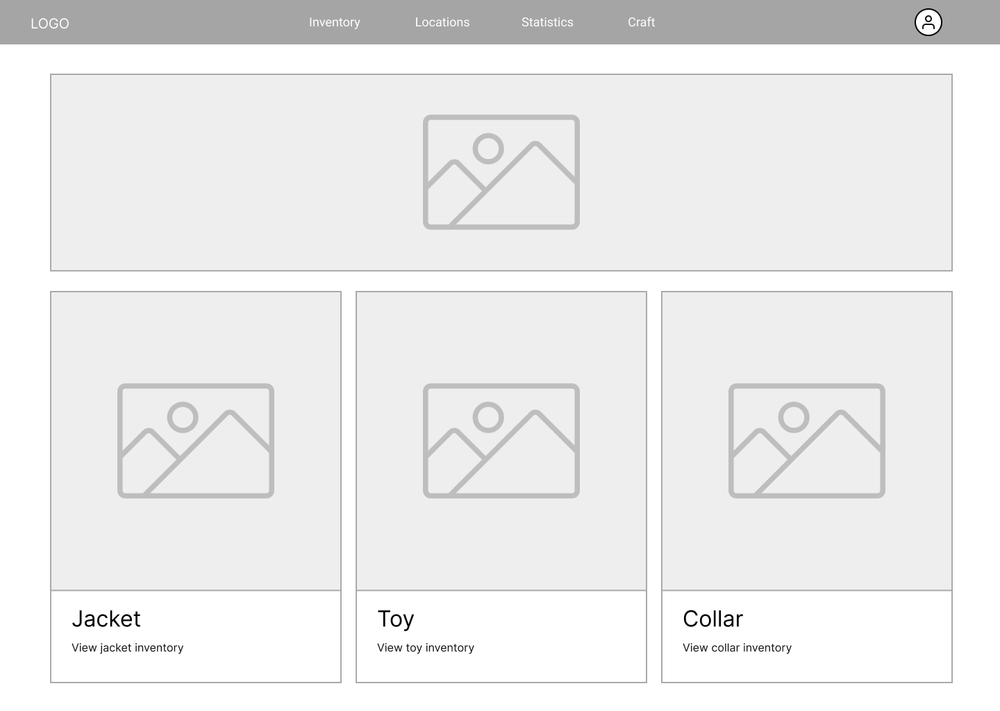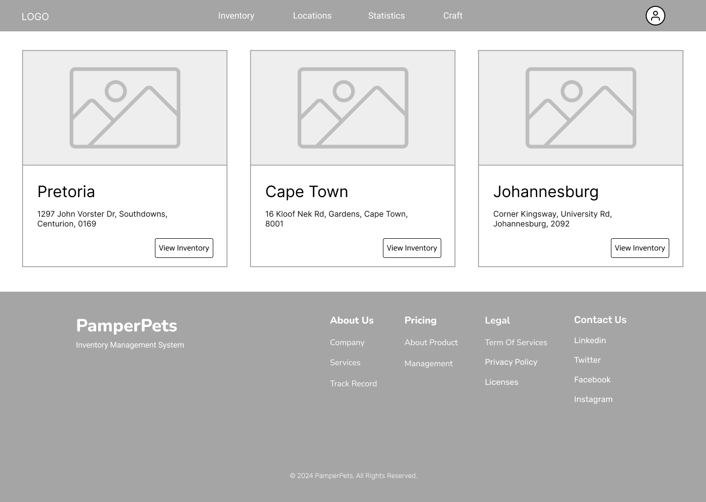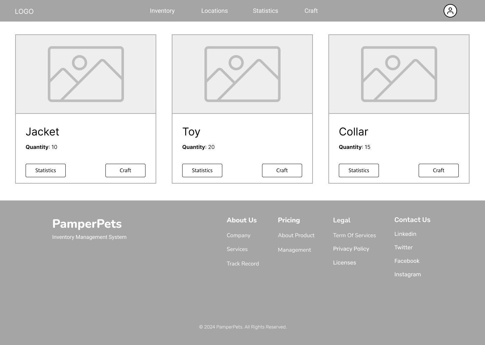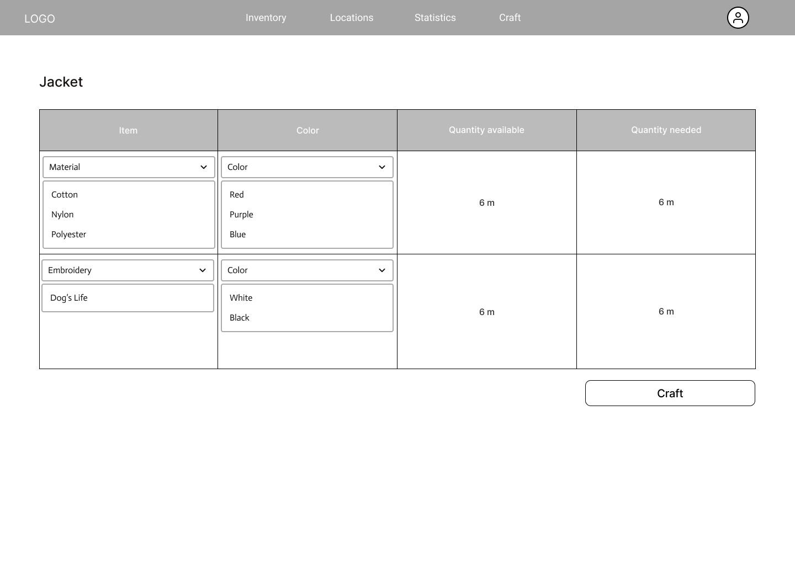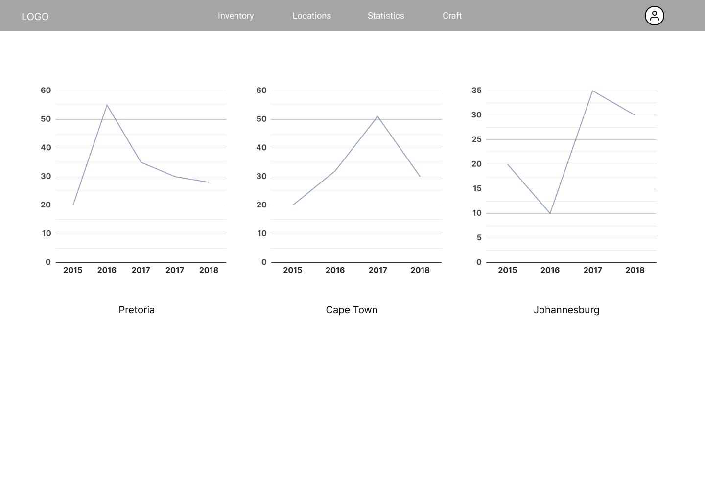

### User-flow


<!-- DEVELOPMENT PROCESS -->
## Development Process

The `Development Process` is the technical implementations and functionality done in the frontend and backend of the application.

### Implementation Process
<!-- stipulate all of the functionality you included in the project -->

* Made use of both `TypeScript` and `Angular` to create a pet clothing and accessory inventory management system. 
* Made use of both `Unsplash` and `Pexels` images.

#### Highlights
<!-- stipulated the highlight you experienced with the project -->
* Achieved 90% project completion 
* Implemented a simple and elegant design

#### Challenges
<!-- stipulated the challenges you faced with the project and why you think you faced it or how you think you'll solve it (if not solved) -->
* Difficulty in enabling users to switch between different warehouses for managing location specific inventory.

### Future Implementation
<!-- stipulate functionality and improvements that can be implemented in the future. -->

* Implement functionality to allow users to switch between different warehouses for managing location specific inventory.
* Enhance the design

<!-- MOCKUPS -->
## Final Outcome

### Mockups


<br>
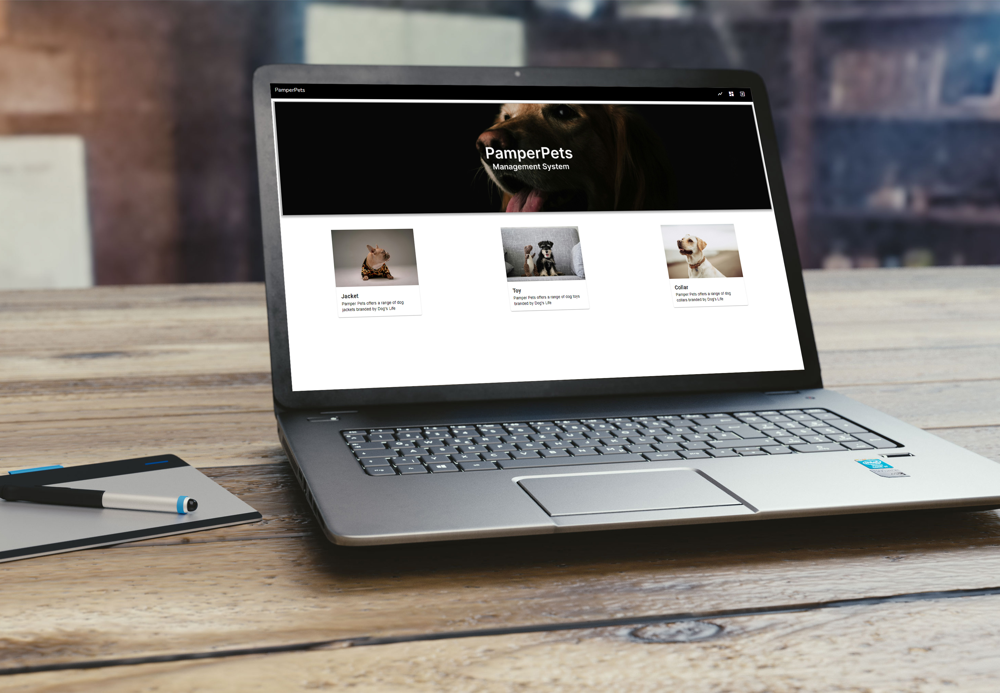

<!-- VIDEO DEMONSTRATION -->
### Video Demonstration

To see a run through of the application, click below:

[View Demonstration](https://drive.google.com/file/d/1hrXlPQm_waY5H67_-hV0N54cOaK6-GcC/view?usp=sharing)

<!-- CONTRIBUTING -->
## Contributing

Contributions are what makes the open-source community such an amazing place to learn, inspire, and create. Any contributions you make are **greatly appreciated**.

1. Fork the Project
2. Create your Feature Branch (`git checkout -b feature/PamperPets`)
3. Commit your Changes (`git commit -m 'Add some PamperPets'`)
4. Push to the Branch (`git push origin feature/PamperPets`)
5. Open a Pull Request

<!-- AUTHORS -->
## Authors

* **Anke Du Raan** - [AnkeatOpenWindow](https://github.com/AnkeatOpenWindow)
* **Hannah Naidoo** - [HannahAmaria](https://github.com/HannahAmaria)

<!-- LICENSE -->
## License

Distributed under the MIT License. See `LICENSE` for more information.\

<!-- LICENSE -->
## Contact

* **Anke Du Raan** - [221202@virtualwindow.co.za](221202@virtualwindow.co.za)
* **Hannah Naidoo** - [21100366@virtualwindow.co.za](21100366@virtualwindow.co.za)
* **Project Link** - https://github.com/AnkeatOpenWindow/PamperPets-front-end

<!-- ACKNOWLEDGEMENTS -->
## Acknowledgements
<!-- all resources that you used and Acknowledgements here -->
* [Angular Material](https://material.angular.io/components/categories)
* [ChatGPT](https://chatgpt.com/)

<!-- MARKDOWN LINKS & IMAGES -->
[image1]: /path/to/image.png
[image2]: /path/to/image.png
[image3]: /path/to/image.png
[image4]: /path/to/image.png
[image5]: /path/to/image.png
[image6]: /path/to/image.png
[image7]: /path/to/image.png
[image8]: /path/to/image.png
[image9]: /path/to/image.png
[image10]: /path/to/image.png


<!-- Refer to https://shields.io/ for more information and options about the shield links at the top of the ReadMe file -->
[linkedin-shield]: https://img.shields.io/badge/-LinkedIn-black.svg?style=flat-square&logo=linkedin&colorB=555
[linkedin-url]: https://www.linkedin.com/in/nameonlinkedin/
[instagram-shield]: https://img.shields.io/badge/-Instagram-black.svg?style=flat-square&logo=instagram&colorB=555
[instagram-url]: https://www.instagram.com/instagram_handle/
[behance-shield]: https://img.shields.io/badge/-Behance-black.svg?style=flat-square&logo=behance&colorB=555
[behance-url]: https://www.behance.net/name-on-behance/
